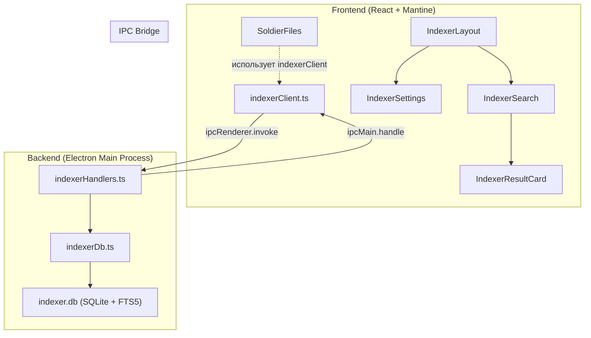
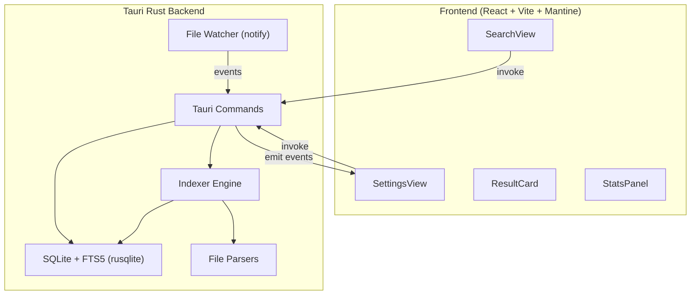

# Индексатор файлов — Описание модуля и план Tauri-приложения

## 1. Описание существующего модуля в «Бригадир»

### 1.1. Общая архитектура

Модуль индексации встроен в Electron-приложение «Бригадир» (кадровая система) и состоит из **3 слоёв**:



---

### 1.2. Backend — Electron Main Process

#### [indexerDb.ts](file:///c:/Users/mrjoh/YandexDisk/JOB/PROJECTS/kadrovik/electron/indexerDb.ts)
Модуль базы данных индексатора:
- **SQLite** с `WAL` журналом и `foreign_keys`
- Отдельная БД `indexer.db` (не в основной `brigadir.db`)
- Portable-режим: при запуске из portable-сборки БД хранится в `brigadir-data/`

**Схема БД:**

| Таблица | Назначение |
|---------|-----------|
| `indexed_folders` | Отслеживаемые папки (path, created_at, last_indexed_at, file_count, total_words, error_count) |
| `indexed_documents` | Проиндексированные файлы (folder_id FK, path, filename, size_bytes, modified_at, word_count, status) |
| `documents_fts` | FTS5 виртуальная таблица (document_id UNINDEXED, filename, content), токенизация `unicode61` |

#### [indexerHandlers.ts](file:///c:/Users/mrjoh/YandexDisk/JOB/PROJECTS/kadrovik/electron/indexerHandlers.ts)
IPC-обработчики (13 619 байт, ~393 строки):

| IPC Channel | Описание |
|-------------|----------|
| `indexer:add-folder` | Диалог выбора папки → вставка в `indexed_folders` → **асинхронная** индексация |
| `indexer:remove-folder` | Удаление папки + каскадное удаление документов и FTS-записей |
| `indexer:list-folders` | Список папок с агрегированной статистикой (COUNT, SUM) |
| `indexer:reindex` | Повторная индексация существующей папки |
| `indexer:search` | **Основной поиск** — FTS5 MATCH с режимами и фильтрами |
| `indexer:open-file` | Открытие файла через `shell.openPath` |
| `indexer:open-folder` | Показать файл в проводнике через `shell.showItemInFolder` |
| `indexer:get-stats` | Общая статистика индекса |
| `indexer:progress` | **Event** (не handle) — прогресс индексации в реальном времени |

**Ключевые особенности индексации:**
- Рекурсивный обход папки, **только `.docx`** файлы
- Извлечение текста через `mammoth` (npm)
- Инкрементальная индексация: пропускает файлы если `modified_at` не изменился
- Удаление из индекса файлов, удалённых с диска
- Транзакционная запись: `BEGIN TRANSACTION` + коммит каждые 200 файлов
- Прогресс отправляется каждые 5 файлов через IPC event

**Ключевые особенности поиска:**
- **3 режима**: `all` (по всему), `filename` (по имени), `content` (по содержимому)
- **2 типа совпадения**: `partial` (prefix-поиск через `word*`) и `exact` (фразовый поиск через `"phrase"`)
- **Фильтры**: soldierTerms (ФИО во всех падежах + личный номер), positionTerms (должность в склонениях), folderId
- Поддержка «неразрывного дефиса» (`‑` U+2011) в личных номерах
- Сниппеты через `snippet()` FTS5 функцию с HTML `<mark>` подсветкой
- Лимит 100 результатов, сортировка по `rank`

---

### 1.3. IPC Bridge

#### [indexerClient.ts](file:///c:/Users/mrjoh/YandexDisk/JOB/PROJECTS/kadrovik/src/utils/indexerClient.ts)
Типизированная обёртка над `ipcRenderer.invoke` с интерфейсами:
- `IndexerFolder`, `IndexerResult`, `IndexerStats`, `IndexProgress`
- Graceful fallback: если `ipc` недоступен — возвращает пустые данные

---

### 1.4. Frontend — React-компоненты

#### [IndexerLayout.tsx](file:///c:/Users/mrjoh/YandexDisk/JOB/PROJECTS/kadrovik/src/components/Indexer/IndexerLayout.tsx)
Табы: «Поиск» / «Настройки индекса»

#### [IndexerSearch.tsx](file:///c:/Users/mrjoh/YandexDisk/JOB/PROJECTS/kadrovik/src/components/Indexer/IndexerSearch.tsx) (345 строк)
- Поисковая строка с debounce 300ms
- Pill-переключатели режимов и типов совпадения
- 3 фильтра-Select: Папка, Военнослужащий, Должность (данные из основной БД `brigadir.db`)
- Счётчик результатов, empty-state, loading-state

#### [IndexerResultCard.tsx](file:///c:/Users/mrjoh/YandexDisk/JOB/PROJECTS/kadrovik/src/components/Indexer/IndexerResultCard.tsx) (146 строк)
- Карточка файла: имя (с HTML-подсветкой), путь, сниппет содержимого
- Мета-данные: дата, размер, количество слов
- Кнопки: «Открыть файл», «Показать в папке»
- Hover-эффект с тенью

#### [IndexerSettings.tsx](file:///c:/Users/mrjoh/YandexDisk/JOB/PROJECTS/kadrovik/src/components/Indexer/IndexerSettings.tsx) (289 строк)
- Статистика индекса: 4 карточки (папок, файлов, слов, ошибок)
- Список отслеживаемых папок с действиями (переиндексировать / удалить)
- Прогресс-бар при активной индексации (подписка через `onProgress`)
- Кнопка «+ Добавить папку» через системный диалог

#### [SoldierFiles.tsx](file:///c:/Users/mrjoh/YandexDisk/JOB/PROJECTS/kadrovik/src/components/SoldierFiles.tsx) (149 строк)
- Дерево файлов бойца (использует [tree.ts](file:///c:/Users/mrjoh/YandexDisk/JOB/PROJECTS/kadrovik/src/utils/tree.ts))
- Поиск по личному номеру + ФИО во всех падежах
- Компонент используется внутри профиля военнослужащего — **специфичен для Бригадира, не переносится**

---

## 2. Что нужно сделать для Tauri-приложения

### 2.1. Концепция

Создать **автономное**, **лёгкое** десктоп-приложение для индексации и поиска по локальным файлам.

**Ключевые отличия от модуля в Бригадире:**

| Аспект | Бригадир (текущий) | Tauri (новый) |
|--------|-------------------|---------------|
| Runtime | Electron (~150 МБ) | Tauri/WebView2 (~5-10 МБ) |
| Backend | Node.js + sqlite3 npm | Rust + rusqlite |
| Форматы | Только `.docx` | `.docx`, `.doc`, `.pdf`, `.txt`, `.rtf`, `.odt`, `.xlsx`, `.pptx` и др. |
| Парсер | `mammoth` (JS) | Rust-крейты: `docx-rs`, `pdf-extract`, `calamine` и т.д. |
| Фильтры | Военнослужащий, Должность (привязка к кадровой БД) | **Убрать** — только универсальные фильтры (папка, тип файла, дата) |
| Мониторинг | Нет (только ручной reindex) | `notify` (watchdog) — автоматическое отслеживание изменений |
| UI Framework | Mantine 9 (через Electron) | Аналогичный стек: React + Mantine (через Tauri WebView) |

---

### 2.2. Архитектура Tauri-приложения



---

## 3. Подробный план реализации

### Фаза 0 — Инициализация проекта

#### Шаг 0.1 — Создание Tauri-проекта
- `npm create tauri-app@latest` с шаблоном React + TypeScript + Vite
- Имя проекта: `file-indexer` (или по желанию)
- Структура:

```
file-indexer/
├── src/                    # React frontend
│   ├── components/
│   │   ├── SearchView.tsx
│   │   ├── SettingsView.tsx
│   │   ├── ResultCard.tsx
│   │   └── StatsPanel.tsx
│   ├── utils/
│   │   ├── commands.ts     # Tauri invoke wrappers
│   │   └── tree.ts         # Копия из Бригадира
│   ├── App.tsx
│   ├── App.css
│   └── main.tsx
├── src-tauri/              # Rust backend
│   ├── src/
│   │   ├── main.rs
│   │   ├── db.rs           # SQLite + FTS5
│   │   ├── indexer.rs      # Движок индексации
│   │   ├── parsers/        # Парсеры файлов
│   │   │   ├── mod.rs
│   │   │   ├── docx.rs
│   │   │   ├── pdf.rs
│   │   │   ├── txt.rs
│   │   │   └── xlsx.rs
│   │   ├── watcher.rs      # File watcher (notify)
│   │   └── commands.rs     # Tauri commands
│   ├── Cargo.toml
│   └── tauri.conf.json
└── package.json
```

#### Шаг 0.2 — Зависимости

**Rust (`Cargo.toml`):**
```toml
[dependencies]
tauri = { version = "2", features = ["dialog", "shell"] }
rusqlite = { version = "0.31", features = ["bundled", "fts5"] }
serde = { version = "1", features = ["derive"] }
serde_json = "1"
notify = "6"                    # File system watcher
walkdir = "2"                   # Рекурсивный обход
docx-rs = "0.4"                 # Парсинг .docx
pdf-extract = "0.7"             # Парсинг .pdf
calamine = "0.24"               # Парсинг .xlsx/.xls
encoding_rs = "0.8"             # Кодировки для .txt
tokio = { version = "1", features = ["full"] }
```

**Frontend (`package.json`):**
```json
{
  "dependencies": {
    "@tauri-apps/api": "^2",
    "@tauri-apps/plugin-dialog": "^2",
    "@tauri-apps/plugin-shell": "^2",
    "@mantine/core": "^9",
    "@mantine/hooks": "^9",
    "lucide-react": "^1",
    "react": "^19",
    "react-dom": "^19"
  }
}
```

---

### Фаза 1 — Rust-бэкенд: БД и индексация

#### Шаг 1.1 — Модуль `db.rs`
Порт [indexerDb.ts](file:///c:/Users/mrjoh/YandexDisk/JOB/PROJECTS/kadrovik/electron/indexerDb.ts) на Rust:

```rust
// Та же схема, но через rusqlite
// indexed_folders, indexed_documents, documents_fts (FTS5)
// + Новое: поле `file_type TEXT` в indexed_documents (docx/pdf/txt/xlsx)
```

- `init_db()` — открытие/создание БД, применение миграций
- `run()`, `get()`, `all()` — обёртки над rusqlite
- БД хранится рядом с exe (portable) или в `app_data_dir`

#### Шаг 1.2 — Модуль `parsers/`
Извлечение текста из файлов:

| Формат | Крейт | Приоритет |
|--------|-------|-----------|
| `.docx` | `docx-rs` или кастомный XML-парсер | 🔴 P0 (основной) |
| `.txt`, `.md`, `.csv`, `.log` | `std::fs::read_to_string` + `encoding_rs` | 🔴 P0 |
| `.pdf` | `pdf-extract` | 🟡 P1 |
| `.xlsx`, `.xls` | `calamine` | 🟡 P1 |
| `.rtf` | Кастомный парсер или шелл-вызов | 🟢 P2 |
| `.odt` | ZIP + XML | 🟢 P2 |
| `.pptx` | ZIP + XML | 🟢 P2 |

Каждый парсер реализует трейт:
```rust
pub trait FileParser: Send + Sync {
    fn extensions(&self) -> &[&str];
    fn extract_text(&self, path: &Path) -> Result<String>;
}
```

#### Шаг 1.3 — Модуль `indexer.rs`
Порт логики из [indexerHandlers.ts](file:///c:/Users/mrjoh/YandexDisk/JOB/PROJECTS/kadrovik/electron/indexerHandlers.ts):

- `index_folder(folder_id, folder_path)` — рекурсивный обход через `walkdir`, фильтрация по расширениям
- Инкрементальная логика: проверка `modified_at` — пропуск неизменённых
- Удаление «мёртвых» записей (файлы удалены с диска)
- Транзакционная запись батчами по 200 файлов
- Прогресс через Tauri events: `app.emit("indexer:progress", payload)`

#### Шаг 1.4 — Модуль `watcher.rs`

> [!IMPORTANT]
> Это **новый функционал**, которого нет в Бригадире.

- `notify` крейт для отслеживания изменений в реальном времени
- При создании/изменении/удалении файла в отслеживаемой папке — автоматическая переиндексация
- Debounce 2 секунды (чтобы не индексировать промежуточные сохранения)
- Можно включить/выключить в настройках

#### Шаг 1.5 — Модуль `commands.rs`
Tauri-команды (аналог IPC handlers):

```rust
#[tauri::command]
async fn add_folder(app: AppHandle) -> Result<IndexerFolder, String>

#[tauri::command]
async fn remove_folder(id: i64) -> Result<bool, String>

#[tauri::command]
async fn list_folders() -> Result<Vec<IndexerFolder>, String>

#[tauri::command]
async fn reindex(app: AppHandle, id: i64) -> Result<bool, String>

#[tauri::command]
async fn search(
    query: String,
    mode: SearchMode,       // All | Filename | Content
    match_type: MatchType,  // Partial | Exact
    folder_id: Option<i64>,
    file_types: Option<Vec<String>>,  // Новый фильтр
) -> Result<Vec<SearchResult>, String>

#[tauri::command]
async fn open_file(path: String) -> Result<(), String>

#[tauri::command]
async fn show_in_folder(path: String) -> Result<(), String>

#[tauri::command]
async fn get_stats() -> Result<IndexerStats, String>

#[tauri::command]
async fn toggle_watcher(folder_id: i64, enable: bool) -> Result<(), String>
```

---

### Фаза 2 — React-фронтенд

#### Шаг 2.1 — Настройка Mantine + дизайн-система
- Установка `@mantine/core`, `@mantine/hooks`, `lucide-react`
- Цветовая тема: сохранить olive-accent из Бригадира или выбрать новую
- Тёмная тема по умолчанию (современный стиль)
- Кастомный CSS: переменные, анимации, glassmorphism

#### Шаг 2.2 — Модуль `commands.ts`
Замена `indexerClient.ts` — обёртка над `@tauri-apps/api/core`:

```typescript
import { invoke } from '@tauri-apps/api/core';
import { listen } from '@tauri-apps/api/event';

export const commands = {
  addFolder: () => invoke<IndexerFolder | null>('add_folder'),
  removeFolder: (id: number) => invoke<boolean>('remove_folder', { id }),
  listFolders: () => invoke<IndexerFolder[]>('list_folders'),
  reindex: (id: number) => invoke<boolean>('reindex', { id }),
  search: (query: string, mode: string, matchType: string, folderId?: number, fileTypes?: string[]) =>
    invoke<SearchResult[]>('search', { query, mode, matchType, folderId, fileTypes }),
  openFile: (path: string) => invoke('open_file', { path }),
  showInFolder: (path: string) => invoke('show_in_folder', { path }),
  getStats: () => invoke<IndexerStats>('get_stats'),
  toggleWatcher: (folderId: number, enable: boolean) => invoke('toggle_watcher', { folderId, enable }),
  onProgress: (cb: (data: IndexProgress) => void) => listen<IndexProgress>('indexer:progress', e => cb(e.payload)),
};
```

#### Шаг 2.3 — Компонент `SearchView`
Порт [IndexerSearch.tsx](file:///c:/Users/mrjoh/YandexDisk/JOB/PROJECTS/kadrovik/src/components/Indexer/IndexerSearch.tsx) с изменениями:

- **Убрать** фильтры «Военнослужащий» и «Должность» (специфика Бригадира)
- **Добавить** фильтр «Тип файла» (мультиселект: docx, pdf, txt, xlsx...)
- Фильтр «Папка» — оставить как есть
- Debounce 300ms, pill-переключатели, empty/loading states — без изменений

#### Шаг 2.4 — Компонент `ResultCard`
Порт [IndexerResultCard.tsx](file:///c:/Users/mrjoh/YandexDisk/JOB/PROJECTS/kadrovik/src/components/Indexer/IndexerResultCard.tsx):

- Добавить иконку типа файла (docx/pdf/txt/xlsx)
- Badge с типом файла
- Остальное без изменений: подсветка, сниппет, мета, hover-эффект

#### Шаг 2.5 — Компонент `SettingsView`
Порт [IndexerSettings.tsx](file:///c:/Users/mrjoh/YandexDisk/JOB/PROJECTS/kadrovik/src/components/Indexer/IndexerSettings.tsx):

- Статистика: + карточка «Форматов» (сколько каких типов)
- Toggle «Автоматическое отслеживание» (file watcher вкл/выкл)
- Настройки: какие расширения индексировать (чекбоксы)
- Drag-and-drop зона для добавления папок (в дополнение к кнопке)

#### Шаг 2.6 — Главное окно (`App.tsx`)
- Sidebar или табы: «Поиск» / «Настройки»
- Titlebar: кастомный (Tauri `decorations: false`) или нативный
- Глобальные горячие клавиши: `Ctrl+F` → фокус на поиск
- Минимальный размер окна: 800×600

---

### Фаза 3 — Полировка и сборка

#### Шаг 3.1 — UX-детали
- Drag-and-drop папок на окно приложения → автодобавление
- Системный трей (опционально): мониторинг в фоне
- Toast-уведомления при завершении индексации
- Keyboard navigation по результатам (↑/↓, Enter = открыть)

#### Шаг 3.2 — Производительность
- Индексация в отдельном потоке (`tokio::spawn_blocking`)
- Lazy-loading результатов (виртуальный скролл при >100 результатов)
- Кэширование частых запросов

#### Шаг 3.3 — Сборка и дистрибуция
```bash
# Разработка
npm run tauri dev

# Продакшн-сборка
npm run tauri build
```

- Targets: `.msi` (NSIS installer), `.exe` (portable)
- Поддержка архитектур: x64 (основная), arm64 (опционально)
- Иконка приложения, splash screen

---

## 4. Open Questions

> [!IMPORTANT]
> **Название приложения** — «File Indexer»? «DocSearch»? «Индексатор»? Или есть предпочтение?

> [!IMPORTANT]
> **Дизайн** — Повторить olive-стиль Бригадира или сделать новый дизайн с нуля? Тёмная тема по умолчанию?

> [!NOTE]
> **Приоритет форматов** — Начать только с `.docx` + `.txt` (как MVP), а затем добавить `.pdf`, `.xlsx`? Или сразу все?

> [!NOTE]
> **File Watcher** — Включать автоматическое отслеживание сразу или отложить на вторую итерацию?

> [!NOTE]
> **Где создать проект?** — Рядом с `kadrovik` в `PROJECTS/file-indexer`? Или в другой директории?

---

## 5. Verification Plan

### Автоматические проверки
- `cargo build` — компиляция Rust-бэкенда без ошибок
- `cargo test` — unit-тесты парсеров и поисковых запросов
- `npm run tauri dev` — запуск в dev-режиме

### Ручная проверка
- Добавить тестовую папку с 50+ файлами разных форматов
- Проверить поиск: partial, exact, фильтры
- Проверить прогресс-бар при индексации
- Проверить «Открыть файл» и «Показать в папке»
- Собрать portable `.exe` и проверить запуск на чистой машине
